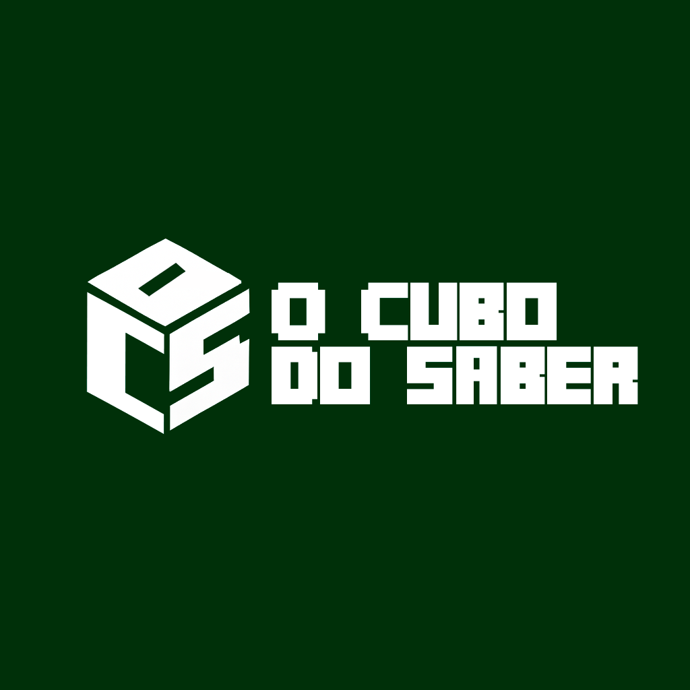

# 🎲 O Cubo do Saber



Bem-vindo ao **O Cubo do Saber**, um portal web criado como uma plataforma educacional gamificada. O projeto nasceu com o propósito de transformar a educação, utilizando um universo lúdico e familiar para construir uma ponte sólida para o conhecimento, provando que aprender pode ser uma aventura épica.

Este repositório contém o código-fonte completo do portal, desenvolvido com Flask e MySQL.

## ✨ Principais Funcionalidades

-   **Página Inicial (`index.html`):** Uma landing page moderna e com design responsivo para apresentar o projeto.
-   **Página Sobre Nós (`about.html`):** Uma seção dedicada que explica a missão e o propósito do projeto.
-   **Sistema de Cadastro (`register.html`):** Um formulário para que novos usuários solicitem a criação de suas contas.
    -   Tooltips de ajuda interativos para guiar o usuário no preenchimento.
-   **Página de Sucesso (`success.html`):** Uma tela de confirmação amigável após o envio bem-sucedido de uma solicitação de cadastro.
-   **Backend Seguro:** Utiliza variáveis de ambiente para proteger informações sensíveis como a `SECRET_KEY`.

## 🛠️ Tecnologias Utilizadas

-   **Backend:**
    -   Python 3
    -   Flask (Microframework web)
    -   `mysql-connector-python` (Para comunicação com o banco de dados)
    -   `python-dotenv` (Para gerenciamento de variáveis de ambiente)
-   **Frontend:**
    -   HTML5
    -   CSS3
    -   Google Fonts (`Poppins` e `Press Start 2P`)
    -   Font Awesome (Para ícones)
-   **Banco de Dados:**
    -   MySQL


### Clone o Repositório

```bash
git clone <URL_DO_SEU_REPOSITORIO_GIT>
cd O-Cubo-do-Saber
```

## 📂 Estrutura do Projeto

```
/o-cubo-do-saber
|-- .env
|-- .gitignore
|-- app.py
|-- README.md
|-- requirements.txt
|-- /static
|   |-- /css
|   |   |-- styles.css
|   |-- /imgs
|       |-- /logo
|       |-- /mine
|-- /templates
    |-- about.html
    |-- index.html
    |-- register.html
    |-- success.html
```

## 📧 Contato

-   contato.ocubodosaber@gmail.com
-   [GitHub do Projeto](https://github.com/chrysto1/O-Cubo-do-Saber)

---